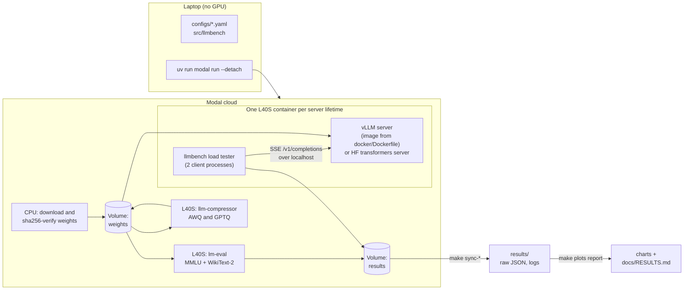

# Quantized LLM Serving & Benchmarking

[](https://github.com/TechBroMoho/quantized-llm-serving/actions/workflows/ci.yml)

I compressed an open 8-billion-parameter language model (`Qwen/Qwen3-8B`) from
16-bit to 4-bit weights, measured how much accuracy that cost, and served it
with [vLLM](https://github.com/vllm-project/vllm) on a cloud GPU. I benchmarked
it against a plain Hugging Face `transformers` server with a load tester I
wrote and validated myself, at up to 256 simultaneous users. Every number
below comes from a saved raw result, and the reproduce command is committed.
The whole project cost **$20.37** of GPU time.

**Full results with a link to the raw file behind every number:
[`docs/RESULTS.md`](docs/RESULTS.md).**

## What it does, in plain English

An LLM is a large file of numbers (weights). An *inference engine* is the
software that runs it to produce text. This project asks two separate
questions:

1. **What does compression buy, and what does it cost?** Storing each weight
   in 4 bits instead of 16 makes the model about a third of the size. That is
   like saving a RAW photo as a JPEG: much smaller, slightly lossy. I made two
   4-bit versions with different methods (AWQ and GPTQ, via `llm-compressor`)
   and measured their accuracy on MMLU, a 14,042-question knowledge test.
2. **How much does the serving engine matter?** vLLM batches many users'
   requests together on the GPU. A basic Hugging Face server answers them one
   at a time. I measured both on the same GPU with identical prompts.

Two different things make the system faster, and the results keep them apart.

## Results

Measured on one NVIDIA L40S (48 GB), 512-token prompts, 256 generated tokens
per request, greedy decoding. Headline values are medians of 3 runs.

| Question | Comparison (only one thing changes) | Result |
| --- | --- | --- |
| **Engine gain** | vLLM vs Hugging Face, both with the original 16-bit weights | Peak throughput **48.79×** a one-request-at-a-time HF server, **2.00×** HF with static batching. With one user the two are close (43.7 vs 40.1 tokens/s) |
| **Quantization gain** | 4-bit AWQ vs 16-bit, both on vLLM | Single-user generation **2.35× faster** (102.6 vs 43.7 tokens/s). Model weights **62.6% smaller** in GPU memory. KV cache holds **1.44×** more tokens. Peak throughput only **1.12×** |
| **Accuracy cost** | Same 14,042 MMLU questions | AWQ **0.95 percentage points** lower (74.88% → 73.93%); GPTQ 1.65 points lower |
| **Both together** | vLLM + AWQ vs Hugging Face | Peak requests/s **54.14×** the one-at-a-time HF server, **2.27×** HF with static batching |


More charts: [p95 time to first token](results/analysis/2_ttft_p95.png),
[time per output token](results/analysis/3_tpot_p50.png),
[latency vs throughput](results/analysis/4_latency_throughput.png),
[accuracy](results/analysis/6_accuracy.png).

### Engine vs quantization: two different speedups

- **The engine gain is about many users.** A single request reads all 15 GiB of
  weights for every token it generates, and that memory read is the
  bottleneck, so for one user vLLM and Hugging Face are about equal. vLLM's
  advantage comes from *continuous batching*: new requests join the running
  batch at every step, so one weight read serves up to 256 sequences. Its
  *paged KV cache* stores each sequence's attention state in small blocks,
  with no padded rectangle per batch. The one-at-a-time HF server stays flat
  at 40 tokens/s however many users wait. Most of the 54× comes from here:
  vLLM with the unquantized weights already reaches 47.72× on requests/s.
- **The quantization gain is about bytes per token.** 4-bit weights mean about
  a third as many bytes to read per generated token. For one user that makes
  generation 2.35× faster; the bandwidth ceiling for this layout is about
  3.1× ([ADR-001](docs/DECISIONS.md#adr-001--default-model-and-analytical-ceilings-2026-09-23)).
  Under heavy batching the weights are read once for the whole batch, so the
  gain shrinks to 1.12×. The freed memory becomes extra KV-cache room, which
  this workload did not need but longer contexts would.
- **The fair baseline is HF with static batching** (2.27×), not the naive
  server (54.14×). Both are reported. The static-batching figure is an upper
  bound, because its batch size of 128 was the largest *tested*, not proven the
  largest that fits
  ([caveat](docs/RESULTS.md#both-together-vllm-awq-vs-hugging-face)).

### Resume bullets

Written for a non-specialist reader. Each number is rounded from a measured
value and traced to its evidence in
[RESULTS.md → Resume bullets](docs/RESULTS.md#resume-bullets).

> - Compressed an 8B-parameter LLM to 4-bit with AWQ, shrinking the model's
>   memory footprint by 63% and generating text 2.3x faster for a single user
>   while staying within 1 percentage point of the original's accuracy
> - Served it with vLLM on cloud GPUs and built a custom load tester simulating
>   up to 256 simultaneous users, reaching 54x the throughput of a basic
>   Hugging Face server

## How the benchmark works



- **Workload.** 50,000 distinct 512-token windows of WikiText-103 are sent as
  token IDs, so neither server re-tokenizes. Each request uses a prompt never
  seen before in that server's lifetime, and vLLM's prefix cache is off, so
  there is no cache reuse. Every request must generate exactly 256 tokens. The
  server's own `usage` count is checked, and any mismatch fails the point.
- **Closed loop.** N virtual users each send a new request as soon as their
  last one finishes. vLLM runs at 1 to 256 users. HF naive runs only at 1, 4 and
  16: it serves one request at a time, so more users just lengthen the queue.
- **Steady-state windows.** Users start staggered, a warmup is discarded, and
  one window is measured. A point counts only if the window's two halves agree
  within 5%, no request errored, and the client stayed under a third of its
  measured capacity. Failed points are kept and listed, never used
  ([ADR-020](docs/DECISIONS.md#adr-020--steady-state-measurement-windows-for-phase-6-2026-09-23)).
- **Same container.** The server and the load tester share one GPU container
  and talk over localhost, so internet latency never enters the timings.
- **The load tester is tested.** Against a mock server that records when it
  actually wrote each token, the client's timings must match within ±5%. A
  deliberately broken timer must fail that test. Its capacity was measured
  inside the Modal container too. At 1 and 64 users it agrees with vLLM's own
  `vllm bench serve` within 3.3%. At 256 users the two differ by 23.5% because
  they start users differently; a diagnostic run with vLLM's all-at-once start
  agreed within 2.4%
  ([cross-check](docs/RESULTS.md#cross-check-against-vllm-bench-serve)).

Metric definitions and methodology: [SPEC §5–6](docs/SPEC.md) and
[RESULTS → Methodology](docs/RESULTS.md#methodology). Every design choice has
a decision record in [`docs/DECISIONS.md`](docs/DECISIONS.md).

## Quickstart (local, no GPU, $0)

Needs [`uv`](https://docs.astral.sh/uv/) and Python 3.12 (uv installs it).

```bash
make setup
```

```bash
make check
```

`make check` runs ruff, strict mypy, and the CPU test suite: the mock server,
the load tester, and a Hugging Face server with a tiny model built on the fly.
It also checks that `AGENTS.md` still matches `CLAUDE.md`. To try the load
tester, start the mock server in one terminal:

```bash
uv run llmbench mock serve --port 8765 --ttft-ms 200 --itl-ms 20 --tokens 32
```

Then run 64 requests from 16 simultaneous users in another:

```bash
uv run llmbench load --url http://127.0.0.1:8765/v1/completions --concurrency 16 --requests 64 --output-tokens 32 --out results/local/mock_run.json
```

The summary JSON has throughput and p50/p90/p95/p99 time to first token, time
per output token, inter-chunk latency and end-to-end latency. The `.jsonl`
beside it has every request. `make plots report` rebuilds every chart and
`docs/RESULTS.md` from the committed raw results.

## Run it locally with Docker (NVIDIA GPU)

[`docker/Dockerfile`](docker/Dockerfile) extends the digest-pinned
`vllm/vllm-openai:v0.10.2` image. Modal built the benchmark servers from this
same file. [`docker-compose.yml`](docker-compose.yml) serves any variant from a
local checkpoint directory, with the benchmark's engine flags. Fetch a
checkpoint from the weights Volume; this needs access to the Modal workspace
that ran Phase 4 and downloads ~6 GB for AWQ/GPTQ, ~16 GB for BF16. The target
then sha256-checks every file against the Phase 4 evidence:

```bash
make fetch-checkpoint VARIANT=awq
```

Then serve it on port 8000 (`docker compose` needs the NVIDIA Container
Toolkit):

```bash
MODEL_DIR=checkpoints/qwen3-8b-awq SERVED_MODEL_NAME=qwen3-8b-awq docker compose up --build
```

Without Modal access, create the checkpoints with the Phase 4 commands below,
or serve the BF16 original after
`uv run hf download Qwen/Qwen3-8B --revision b968826d9c46dd6066d109eabc6255188de91218 --local-dir checkpoints/qwen3-8b-bf16`.
Point the load tester at `http://127.0.0.1:8000/v1/completions` with
`--model qwen3-8b-awq`. That run is a functional check. The benchmark numbers
come from the controlled W1 workload on Modal. `GPU_MEMORY_UTILIZATION`,
`MAX_MODEL_LEN` and `MAX_NUM_SEQS` override the defaults for smaller GPUs.
`make docker-check` lints the Dockerfile with hadolint and validates the
Compose file. CI runs the same checks, but never builds the multi-GB image.

## Reproduce on Modal

All GPU work ran on [Modal](https://modal.com) from a laptop, as detached
ephemeral apps with strict timeouts. These are the five steps, in order. Wait
for each step's app to finish (`uv run modal app list` shows nothing running)
before starting the next. Each cost is what that phase actually paid,
including its probes and failed attempts, from Modal's billing report
([Spend log](PROGRESS.md#spend-log)).

| Step | Command | Actual cost |
| --- | --- | ---: |
| 1. Local checks | `make setup check` | $0 |
| 2. Download + quantize (CPU, then L40S) | `for s in prepare awq gptq sanity; do uv run modal run --detach -m modal_app.quantize::$s \|\| break; done` | $1.27 |
| 3. Accuracy (L40S, spawned) | `make eval-prefetch eval-full`, then `make sync-accuracy` | $10.70¹ |
| 4. Benchmarks (L40S, spawned) | `make bench-prepare`, then `for L in awq awq-followup bf16 gptq-trimmed hf-naive hf-static; do make bench LIFETIME=$L; done` | $8.30 |
| 5. Charts + report | `make sync-bench plots report` | $0 |

¹ Includes ~$1.65 lost when a laptop sleep cancelled one GPTQ attempt. The
Phase 3 smoke tests (L4, $0.10) bring the total to **$20.37**. Needs a Modal
account and a Modal Secret named `huggingface` with an HF read token
([`modal_app/common.py`](modal_app/common.py)).

## Repository layout

```
configs/          YAML for every experiment (model, recipes, engine flags, sweep points)
docker/           Dockerfile: pinned vLLM image + this repo's code
modal_app/        Modal functions: download, quantize, evaluate, bench (all with timeouts)
src/llmbench/
  loadtest/       async streaming load tester: closed/open loop, metrics, validation
  mock/           OpenAI-style SSE mock server that records its own write times
  baseline/       Hugging Face server (naive + static batching) and its OOM probe
  analysis/       aggregate, charts, and the generated RESULTS.md
results/          raw results (JSON, gzipped JSONL, server logs, nvidia-smi samples)
docs/             SPEC, RESULTS (generated), DECISIONS (ADR-001 to ADR-025)
```

## Limitations

- One GPU type (L40S), one model (Qwen3-8B), one synthetic workload (512
  tokens in, 256 out, fixed lengths). Real traffic has variable lengths.
- A single GPU and a single server: no tensor parallelism, and no network
  between client and server (by design).
- The HF static baseline's batch size is the largest tested, not proven the
  largest that fits, so ratios against it are upper bounds.
- The max-batch sweep and GPTQ at 256 users were cut for budget. Most
  non-peak points ran once; repeated points varied by at most 2.6%.
- MMLU is multiple choice. Generative tasks (e.g. GSM8K math) were not
  evaluated and can be more sensitive to quantization.
- AWQ and GPTQ used different calibration data (each method's official
  example), so AWQ vs GPTQ does not isolate the method.

## Future work

- FP8 weights or an FP8 KV cache as extra variants.
- A GSM8K run to see whether reasoning degrades more than MMLU.
- A realistic variable-length workload (ShareGPT-style) as a second data point.
- The skipped max-batch sweep (`--max-num-seqs` 16/64/256), which shows the
  latency vs throughput trade-off.
- A larger HF static batch-size probe, to tighten the fair-baseline ratio.
- A small educational continuous-batching loop in pure PyTorch, benchmarked
  against HF naive.

## Documentation

- [`docs/RESULTS.md`](docs/RESULTS.md): every result, generated from `results/`, every number linked.
- [`docs/DECISIONS.md`](docs/DECISIONS.md): why each choice was made (model, GPU, recipes, windows, baselines).
- [`docs/SPEC.md`](docs/SPEC.md): the original specification and its rules for fair comparisons.
- [`PROGRESS.md`](PROGRESS.md): phase log, spend log, and everything that went wrong.
