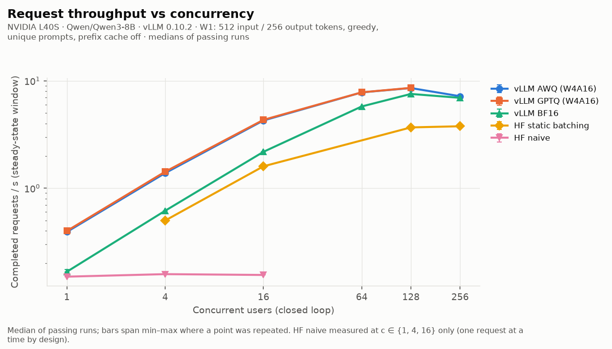
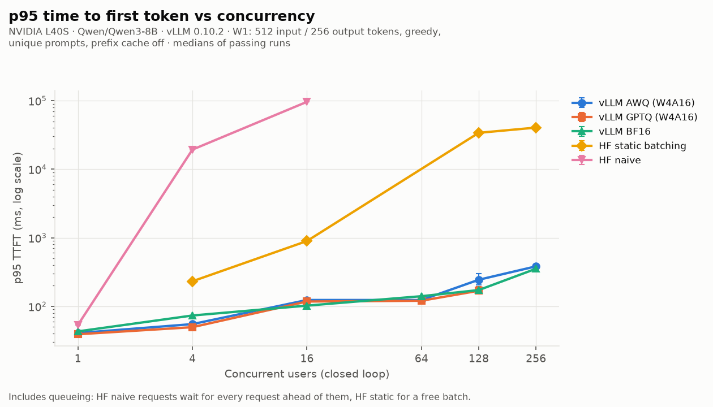
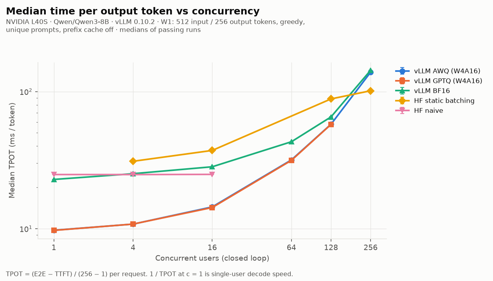
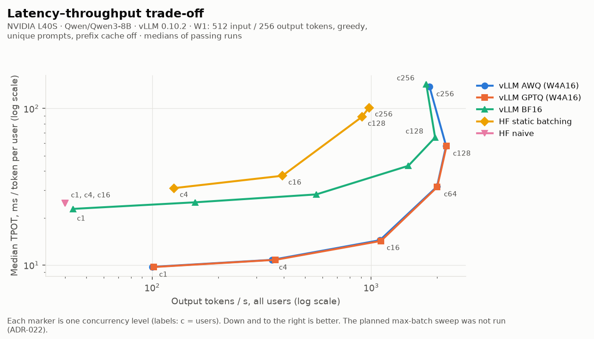
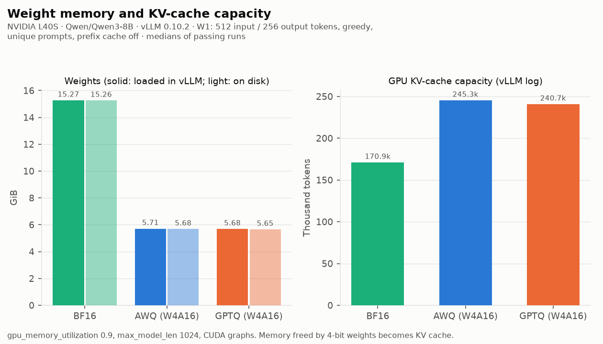
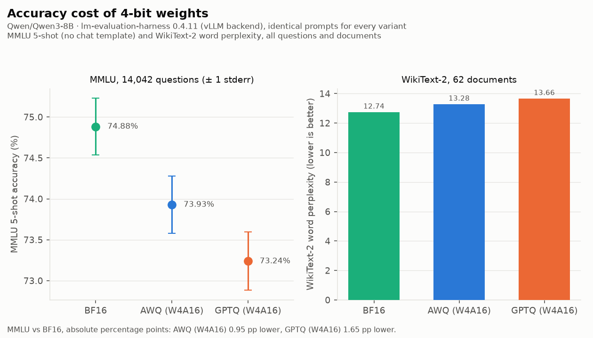

# Results

<!-- Generated by `make report` (src/llmbench/analysis/report.py) from results/analysis/aggregate.json. Do not edit by hand. -->

Qwen/Qwen3-8B in BF16, AWQ W4A16 and GPTQ W4A16, served with vLLM and compared with a plain Hugging Face `transformers` server. Every number below links to the raw result it came from.

## Summary

All numbers were measured on one NVIDIA L40S with the W1 workload (512 input / 256 output tokens, greedy, unique prompts, prefix caching off). Headline values are medians of three passing runs unless a run count says otherwise. Engine gains and quantization gains are reported separately. Each is measured with the other held fixed.

### Engine gain: vLLM vs Hugging Face `transformers`, both BF16

Same BF16 weights, same GPU, same prompts. Only the serving engine differs.

- Peak output throughput: vLLM BF16 [1,957.2](../results/perf/phase6/results_table.md) (c=128, 3 runs: [r1](../results/perf/phase6/bf16-20260924T003034Z/c128/summary.json) [r2](../results/perf/phase6/bf16-20260924T003034Z/c128-r2/summary.json) [r3](../results/perf/phase6/bf16-20260924T003034Z/c128-r3/summary.json)) tokens/s, HF static batching [977.0](../results/perf/phase6/results_table.md) (c=256, 3 runs: [r1](../results/perf/phase6/hf-static-20260924T013433Z/hf-c2B/summary.json) [r2](../results/perf/phase6/hf-static-20260924T013433Z/hf-c2B-r2/summary.json) [r3](../results/perf/phase6/hf-static-20260924T013433Z/hf-c2B-r3/summary.json)), HF naive [40.1](../results/perf/phase6/results_table.md) (c=4, 3 runs: [r1](../results/perf/phase6/hf-naive-20260924T004647Z/hf-c4/summary.json) [r2](../results/perf/phase6/hf-naive-20260924T004647Z/hf-c4-r2/summary.json) [r3](../results/perf/phase6/hf-naive-20260924T004647Z/hf-c4-r3/summary.json)).
- **vLLM BF16 vs HF naive: [48.79×](../results/perf/phase6/results_table.md); vs HF static batching: [2.00×](../results/perf/phase6/results_table.md)** (output tokens/s at each system's peak). Peak requests/s gives [47.72×](../results/perf/phase6/results_table.md) and [2.00×](../results/perf/phase6/results_table.md).
- For one user the engines are close: vLLM BF16 [43.7](../results/perf/phase6/results_table.md) tokens/s (median TPOT 22.9 ms over 3 runs: [r1](../results/perf/phase6/bf16-20260924T003034Z/c1/summary.json) [r2](../results/perf/phase6/bf16-20260924T003034Z/c1-r2/summary.json) [r3](../results/perf/phase6/bf16-20260924T003034Z/c1-r3/summary.json)) vs HF naive [40.1](../results/perf/phase6/hf-naive-20260924T004647Z/c1/summary.json) output tokens/s at c=1 (1 run).

### Quantization gain: vLLM AWQ (W4A16) vs vLLM BF16

Same engine, same settings. Only the checkpoint differs.

- **Single-user decode speed: [2.35×](../results/perf/phase6/results_table.md)**. AWQ [102.6](../results/perf/phase6/results_table.md) tokens/s (median TPOT 9.7 ms over 3 runs: [r1](../results/perf/phase6/awq-20260923T220125Z/c1-r2/summary.json) [r2](../results/perf/phase6/awq-20260923T220125Z/c1-r3/summary.json) [r3](../results/perf/phase6/awq-followup-20260924T000015Z/c1-r4/summary.json)) vs BF16 [43.7](../results/perf/phase6/results_table.md) tokens/s (median TPOT 22.9 ms over 3 runs: [r1](../results/perf/phase6/bf16-20260924T003034Z/c1/summary.json) [r2](../results/perf/phase6/bf16-20260924T003034Z/c1-r2/summary.json) [r3](../results/perf/phase6/bf16-20260924T003034Z/c1-r3/summary.json)). GPTQ reaches [2.35×](../results/perf/phase6/results_table.md) (1 run).
- **Weight memory: [−62.6%](../results/perf/phase6/awq-20260923T220125Z/server.log#L42)** ([5.7088 GiB](../results/perf/phase6/awq-20260923T220125Z/server.log#L42) vs [15.2683 GiB](../results/perf/phase6/bf16-20260924T003034Z/server.log#L46), vLLM's "Model loading took"). On disk: [−62.8%](../results/quantization/phase4/quantize-awq-20260923T103930Z/summary.json).
- KV-cache capacity: [245,312](../results/perf/phase6/awq-20260923T220125Z/server.log#L52) vs [170,944](../results/perf/phase6/bf16-20260924T003034Z/server.log#L57) tokens (1.44×).
- Peak output throughput: [1.12×](../results/perf/phase6/results_table.md) (AWQ [2,196.8](../results/perf/phase6/results_table.md) (c=128, 3 runs: [r1](../results/perf/phase6/awq-20260923T220125Z/c128/summary.json) [r2](../results/perf/phase6/awq-followup-20260924T000015Z/c128-r2/summary.json) [r3](../results/perf/phase6/awq-followup-20260924T000015Z/c128-r3/summary.json)) vs BF16 [1,957.2](../results/perf/phase6/results_table.md)). The single-user gain mostly disappears once decode is batched (see [Where the speedup comes from](#where-the-speedup-comes-from)).
- Accuracy: MMLU 5-shot [73.93%](../results/accuracy/phase5/full-20260923T142440Z/comparison.json) vs [74.88%](../results/accuracy/phase5/full-20260923T142440Z/comparison.json), **[0.95 percentage points lower](../results/accuracy/phase5/full-20260923T142440Z/comparison.json)**; WikiText-2 word perplexity [+4.2%](../results/accuracy/phase5/full-20260923T142440Z/comparison.json).

### Both together: vLLM AWQ vs Hugging Face

- Peak output tokens/s: **[54.76×](../results/perf/phase6/results_table.md) HF naive, [2.25×](../results/perf/phase6/results_table.md) HF static batching**. Peak requests/s: [54.14×](../results/perf/phase6/results_table.md) and [2.27×](../results/perf/phase6/results_table.md).
- The naive ratio mostly measures continuous batching against a server that runs one request at a time. The static-batching ratio is the fair baseline.

> **HF static batch-size caveat.** HF static batching used B = [128](../results/perf/phase6/hf-static-20260924T013433Z/oom_probe.json), the largest size the OOM probe *tested* (8, 16, 32, 48, 64, 96, 128). No candidate ran out of memory ([first_oom = null](../results/perf/phase6/hf-static-20260924T013433Z/oom_probe.json)), so 128 is not shown to be the maximum that fits. The probe's throughput was still rising at the top: [1,006.7](../results/perf/phase6/hf-static-20260924T013433Z/oom_probe.json) tokens/s at B=96 and [1,084.3](../results/perf/phase6/hf-static-20260924T013433Z/oom_probe.json) at B=128. HF static's best point was also the highest concurrency it was run at (c = 2B = 256). A larger B could raise its peak, so the ratios against HF static batching are an upper bound on vLLM's advantage over this baseline, not a tight value.

## Claims and evidence (SPEC §8)

Targets are the SPEC §0 placeholders. They are ambitions, not results; the "Measured" column is what the raw files show.

| Claim | Target | Measured | Definition | Evidence | Date |
| --- | --- | --- | --- | --- | --- |
| Compressed an 8B LLM to 4-bit (AWQ, GPTQ) | — | W4A16 group-128; AWQ asymmetric, GPTQ symmetric; `lm_head` kept BF16 | llm-compressor 0.7.1 `oneshot` | [AWQ summary](../results/quantization/phase4/quantize-awq-20260923T103930Z/summary.json), [GPTQ summary](../results/quantization/phase4/quantize-gptq-20260923T121835Z/summary.json), [config](../configs/phase4_quantize.yaml) | 2026-09-23 |
| Deployed with vLLM in Docker | — | Every vLLM lifetime's server ran in an image built from [`docker/Dockerfile`](../docker/Dockerfile) (`FROM vllm/vllm-openai:v0.10.2`) plus this repo's Python source; image IDs are recorded per lifetime (they change with the source) | `Image.from_dockerfile` in [`modal_app/common.py`](../modal_app/common.py) | [server log](../results/perf/phase6/awq-20260923T220125Z/server.log), [lifetime summary](../results/perf/phase6/awq-20260923T220125Z/lifetime_summary.json), lifetimes table below | 2026-09-23/24 |
| X% less memory | 68% | **62.6%** (AWQ), 62.8% (GPTQ); on disk 62.8% / 62.9% | vLLM "Model loading took" (GiB), 4-bit vs BF16; disk = safetensors bytes | [AWQ log](../results/perf/phase6/awq-20260923T220125Z/server.log#L42), [BF16 log](../results/perf/phase6/bf16-20260924T003034Z/server.log#L46), [GPTQ log](../results/perf/phase6/gptq-trimmed-20260924T010937Z/server.log#L42) | 2026-09-23/24 |
| Nx faster text generation | 3.1× | **2.35×** (AWQ, 3 runs each) | 1 / median TPOT at c=1, AWQ vs BF16 on vLLM | AWQ [r1](../results/perf/phase6/awq-20260923T220125Z/c1-r2/summary.json) [r2](../results/perf/phase6/awq-20260923T220125Z/c1-r3/summary.json) [r3](../results/perf/phase6/awq-followup-20260924T000015Z/c1-r4/summary.json); BF16 [r1](../results/perf/phase6/bf16-20260924T003034Z/c1/summary.json) [r2](../results/perf/phase6/bf16-20260924T003034Z/c1-r2/summary.json) [r3](../results/perf/phase6/bf16-20260924T003034Z/c1-r3/summary.json) | 2026-09-23/24 |
| Accuracy within X% | 1.5% | **0.95 pp** (AWQ), 1.65 pp (GPTQ) | MMLU 5-shot, BF16 − variant, absolute percentage points, 14,042 questions | [comparison.json](../results/accuracy/phase5/full-20260923T142440Z/comparison.json) | 2026-09-23 |
| Load tester simulating 256 users | 256 | 256 closed-loop users; AWQ c=256 [1,844.5](../results/perf/phase6/awq-followup-20260924T000015Z/c256/summary.json) tokens/s, 0 errors | Our tester, validated against the mock (Phase 1, [results](../results/validation/)) and in the Modal container | [r1](../results/perf/phase6/awq-followup-20260924T000015Z/c256/summary.json), [in-Modal check](../results/validation/phase6/loadtest-check-20260923T205147Z/) | 2026-09-24 |
| Nx more requests/s than a standard HF setup | 14× | **54.14×** vs HF naive; **2.27×** vs HF static (B=128, see caveat); vLLM BF16 vs HF: 47.72× / 2.00× | Peak requests/s (median of 3) across each system's sweep | [results table](../results/perf/phase6/results_table.md) | 2026-09-24 |

Environment for every row: NVIDIA L40S (driver 580.95.05), vLLM 0.10.2, torch 2.8.0+cu128. Reproduce: Phase 4 `uv run modal run --detach -m modal_app.quantize::{prepare,awq,gptq,sanity}`; Phase 5 `make eval-full sync-accuracy`; Phase 6 `make bench LIFETIME=<lifetime>` then `make sync-bench report` (billable). All are billable; estimates are required first (CLAUDE.md).

## Methodology

### Hardware and software

- GPU: `NVIDIA L40S, 580.95.05, 46068 MiB, 8.9` (name, driver, memory, compute capability, from `nvidia-smi` in [the run](../results/perf/phase6/awq-20260923T220125Z/lifetime_summary.json)). Every compared number used this GPU type.
- Container: 8 CPU cores, 32,768 MiB memory on Modal, server and load tester in the same container over localhost (ADR-013).
- vLLM image: vLLM 0.10.2, torch 2.8.0+cu128, transformers 4.56.1, Python 3.12.11 ([packages](../results/perf/phase6/awq-20260923T220125Z/lifetime_summary.json)).
- HF baseline image: torch 2.8.0, transformers 4.56.2, BF16, SDPA attention ([packages](../results/perf/phase6/hf-static-20260924T013433Z/lifetime_summary.json)).
- vLLM command: `--served-model-name qwen3-8b-awq --host 127.0.0.1 --port 8000 --dtype bfloat16 --max-model-len 1024 --gpu-memory-utilization 0.90 --max-num-seqs 256 --seed 0 --no-enable-prefix-caching --generation-config vllm --disable-uvicorn-access-log`.
- HF static command: `-m llmbench.baseline.hf_server --model /weights/Qwen/Qwen3-8B/b968826d9c46dd6066d109eabc6255188de91218 --mode static --dtype bfloat16 --host 127.0.0.1 --port 8000 --batch-size 128 --batch-wait-ms 50`.
- Config: [`configs/phase6_bench.yaml`](../configs/phase6_bench.yaml). Its hash changed between lifetimes as lifetimes and points were added, but the measurement sections (model, prompts, workload, vllm, hf) are **identical** across every compared lifetime (checked by the aggregator).

### Workload and windows

- W1: 50,000 distinct 512-token windows of WikiText-103 (train; pool sha256 `155f08a3849a…`, [manifest](../results/perf/phase6/awq-20260923T220125Z/lifetime_summary.json)), sent as token IDs so neither server re-tokenizes (ADR-021). Every lifetime hashed the same pool before use (1 distinct pool hash across lifetimes). Each request uses a prompt never used before in its server lifetime; every lifetime uses the same prompts in the same order.
- 256 output tokens with `ignore_eos` (vLLM) / `min_new_tokens` (HF), greedy. Every request's `usage` must be 512 / 256 or the point fails.
- Closed loop: N users, each sending its next request when the previous one finishes. Users start staggered over a ramp. After a warmup, one steady-state window is measured and requests still running at its end are cut (ADR-020). From c=128, the ramp is one expected request duration and the window is at least 10 of them (ADR-022).
- Output tokens/s counts server-reported tokens (cumulative per-chunk usage) whose chunk arrived inside the window. Requests/s counts requests that *completed* inside it. Latency percentiles use those same completed requests.
- TTFT: request start to the first text chunk. TPOT: (E2E − TTFT) / 255. ITL: gaps between text chunks. Chunks are not always one token each: vLLM merges deltas under load, and every point is checked for at least 0.5 text chunks per token (ADR-014).
- A point is **accepted** only if its window halves agree within 5%, the client received under a third of its validated in-container capacity ([9,124.1 chunks/s](../results/validation/phase6/loadtest-check-20260923T205147Z/capacity_summary.json)), no request errored, every `usage` was exact, and vLLM's prefix-cache hit counter did not move. Failed points are kept and listed below, never used.
- HF naive runs only at c ∈ {1, 4, 16}. It serves one request at a time by design, so its throughput is flat and higher concurrency only lengthens the queue. HF static runs at c ∈ {4, 16, B, 2B}, with timings derived from the OOM probe's measured batch times.
- Not run: the max-batch sweep (`--max-num-seqs` 16/64) and GPTQ at c=256, both cut for budget and time (ADR-022 addendum). No claim depends on them.

### Point windows

| System | c | Ramp s | Warmup s | Window s | Runs |
| --- | ---: | ---: | ---: | ---: | ---: |
| vLLM AWQ (W4A16) | 1 | 0 | 15 | 120 | [r1](../results/perf/phase6/awq-20260923T220125Z/c1-r2/summary.json) [r2](../results/perf/phase6/awq-20260923T220125Z/c1-r3/summary.json) [r3](../results/perf/phase6/awq-followup-20260924T000015Z/c1-r4/summary.json) |
| vLLM AWQ (W4A16) | 4 | 5 | 20 | 120 | [r1](../results/perf/phase6/awq-20260923T220125Z/c4/summary.json) |
| vLLM AWQ (W4A16) | 16 | 8 | 25 | 120 | [r1](../results/perf/phase6/awq-20260923T220125Z/c16/summary.json) |
| vLLM AWQ (W4A16) | 64 | 15 | 40 | 180 | [r1](../results/perf/phase6/awq-20260923T220125Z/c64/summary.json) |
| vLLM AWQ (W4A16) | 128 | 15 / 20 | 50 | 180 | [r1](../results/perf/phase6/awq-20260923T220125Z/c128/summary.json) [r2](../results/perf/phase6/awq-followup-20260924T000015Z/c128-r2/summary.json) [r3](../results/perf/phase6/awq-followup-20260924T000015Z/c128-r3/summary.json) |
| vLLM AWQ (W4A16) | 256 | 36 | 80 | 360 | [r1](../results/perf/phase6/awq-followup-20260924T000015Z/c256/summary.json) |
| vLLM GPTQ (W4A16) | 1 | 0 | 15 | 120 | [r1](../results/perf/phase6/gptq-trimmed-20260924T010937Z/c1/summary.json) |
| vLLM GPTQ (W4A16) | 4 | 5 | 20 | 120 | [r1](../results/perf/phase6/gptq-trimmed-20260924T010937Z/c4/summary.json) |
| vLLM GPTQ (W4A16) | 16 | 8 | 25 | 120 | [r1](../results/perf/phase6/gptq-trimmed-20260924T010937Z/c16/summary.json) |
| vLLM GPTQ (W4A16) | 64 | 15 | 40 | 180 | [r1](../results/perf/phase6/gptq-trimmed-20260924T010937Z/c64/summary.json) |
| vLLM GPTQ (W4A16) | 128 | 15 / 17 | 50 | 180 | [r1](../results/perf/phase6/gptq-trimmed-20260924T010937Z/c128/summary.json) [r2](../results/perf/phase6/gptq-trimmed-20260924T010937Z/c128-r2/summary.json) [r3](../results/perf/phase6/gptq-trimmed-20260924T010937Z/c128-r3/summary.json) |
| vLLM BF16 | 1 | 0 | 15 | 120 | [r1](../results/perf/phase6/bf16-20260924T003034Z/c1/summary.json) [r2](../results/perf/phase6/bf16-20260924T003034Z/c1-r2/summary.json) [r3](../results/perf/phase6/bf16-20260924T003034Z/c1-r3/summary.json) |
| vLLM BF16 | 4 | 5 | 20 | 120 | [r1](../results/perf/phase6/bf16-20260924T003034Z/c4/summary.json) |
| vLLM BF16 | 16 | 8 | 25 | 120 | [r1](../results/perf/phase6/bf16-20260924T003034Z/c16/summary.json) |
| vLLM BF16 | 64 | 15 | 40 | 180 | [r1](../results/perf/phase6/bf16-20260924T003034Z/c64/summary.json) |
| vLLM BF16 | 128 | 17 / 23 | 50 | 180 / 225 | [r1](../results/perf/phase6/bf16-20260924T003034Z/c128/summary.json) [r2](../results/perf/phase6/bf16-20260924T003034Z/c128-r2/summary.json) [r3](../results/perf/phase6/bf16-20260924T003034Z/c128-r3/summary.json) |
| vLLM BF16 | 256 | 34 | 80 | 340 | [r1](../results/perf/phase6/bf16-20260924T003034Z/c256/summary.json) |
| HF static batching | 4 | 5 | 20 | 120 | [r1](../results/perf/phase6/hf-static-20260924T013433Z/c4/summary.json) |
| HF static batching | 16 | 8 | 25 | 120 | [r1](../results/perf/phase6/hf-static-20260924T013433Z/c16/summary.json) |
| HF static batching | 128 | 10 | 60 | 305 | [r1](../results/perf/phase6/hf-static-20260924T013433Z/hf-cB/summary.json) |
| HF static batching | 256 | 20 | 100 | 305 | [r1](../results/perf/phase6/hf-static-20260924T013433Z/hf-c2B/summary.json) [r2](../results/perf/phase6/hf-static-20260924T013433Z/hf-c2B-r2/summary.json) [r3](../results/perf/phase6/hf-static-20260924T013433Z/hf-c2B-r3/summary.json) |
| HF naive | 1 | 0 | 15 | 120 | [r1](../results/perf/phase6/hf-naive-20260924T004647Z/c1/summary.json) |
| HF naive | 4 | 5 | 40 | 120 | [r1](../results/perf/phase6/hf-naive-20260924T004647Z/hf-c4/summary.json) [r2](../results/perf/phase6/hf-naive-20260924T004647Z/hf-c4-r2/summary.json) [r3](../results/perf/phase6/hf-naive-20260924T004647Z/hf-c4-r3/summary.json) |
| HF naive | 16 | 8 | 125 | 180 | [r1](../results/perf/phase6/hf-naive-20260924T004647Z/hf-c16/summary.json) |

### Server lifetimes

| Lifetime | Date | Commit | Dirty | Modal image | Server lifetime s | Points passed |
| --- | --- | --- | --- | --- | ---: | ---: |
| [awq-20260923T220125Z](../results/perf/phase6/awq-20260923T220125Z/lifetime_summary.json) | 2026-09-23 | `3c647e5` | no | `im-URRRdtXGKF9JPFAWnGkTC8` | 2,557 | 6 / 10 |
| [awq-followup-20260924T000015Z](../results/perf/phase6/awq-followup-20260924T000015Z/lifetime_summary.json) | 2026-09-24 | `abdbd1a` | no | `im-bW3BPw7it7kFXIQ9tu5f6l` | 1,628 | 5 / 5 |
| [bf16-20260924T003034Z](../results/perf/phase6/bf16-20260924T003034Z/lifetime_summary.json) | 2026-09-24 | `abdbd1a` | yes | `im-bW3BPw7it7kFXIQ9tu5f6l` | 2,219 | 10 / 10 |
| [gptq-trimmed-20260924T010937Z](../results/perf/phase6/gptq-trimmed-20260924T010937Z/lifetime_summary.json) | 2026-09-24 | `7b5ae56` | no | `im-CQOVPtJFt7CaCdSvPI0Gx5` | 1,492 | 7 / 7 |
| [hf-naive-20260924T004647Z](../results/perf/phase6/hf-naive-20260924T004647Z/lifetime_summary.json) | 2026-09-24 | `6d9cee7` | no | `im-IKgXw0BE66W2sLafGqgqmA` | 957 | 5 / 5 |
| [hf-static-20260924T013433Z](../results/perf/phase6/hf-static-20260924T013433Z/lifetime_summary.json) | 2026-09-24 | `9124dcb` | no | `im-IKgXw0BE66W2sLafGqgqmA` | 1,922 | 6 / 6 |
| [probe-20260923T213438Z](../results/perf/phase6/probe-20260923T213438Z/lifetime_summary.json) | 2026-09-23 | `f49d596` | no | `im-jJYUkL99aFKYQMIgViwtPS` | 337 | 2 / 2 |

GPU spend for the whole project: [$20.37](../results/perf/phase6/modal_billing_2026-09-24.json) (Modal billing report, whole UTC days 2026-09-23 and 2026-09-24), of which benchmarks [$8.27](../results/perf/phase6/modal_billing_2026-09-24.json). The per-run Spend log is in [PROGRESS.md](../PROGRESS.md#spend-log).

## Throughput and latency sweeps









Each value is the median over the listed passing runs (r1, r2, … link to each run's `summary.json`; its `requests.jsonl.gz` beside it has every request). Where there are several runs, the range is in brackets. Every summary also has p50/p90/p95/p99 of TTFT, TPOT, ITL and E2E; [results_table.md](../results/perf/phase6/results_table.md) lists the p99s per run.

| System | c | Output tok/s | Req/s | TTFT p50 / p95 ms | TPOT p50 ms | E2E p50 s | Runs |
| --- | ---: | ---: | ---: | ---: | ---: | ---: | --- |
| vLLM AWQ (W4A16) | 1 | 100.2 [100.0–102.2] | 0.392 | 39.8 / 40.7 | 9.7 | 2.53 | [r1](../results/perf/phase6/awq-20260923T220125Z/c1-r2/summary.json) [r2](../results/perf/phase6/awq-20260923T220125Z/c1-r3/summary.json) [r3](../results/perf/phase6/awq-followup-20260924T000015Z/c1-r4/summary.json) |
| vLLM AWQ (W4A16) | 4 | 352.7 | 1.383 | 50.4 / 54.9 | 10.8 | 2.81 | [r1](../results/perf/phase6/awq-20260923T220125Z/c4/summary.json) |
| vLLM AWQ (W4A16) | 16 | 1,094.8 | 4.275 | 55.6 / 123.5 | 14.4 | 3.74 | [r1](../results/perf/phase6/awq-20260923T220125Z/c16/summary.json) |
| vLLM AWQ (W4A16) | 64 | 1,997.5 | 7.811 | 82.8 / 123.5 | 31.7 | 8.19 | [r1](../results/perf/phase6/awq-20260923T220125Z/c64/summary.json) |
| vLLM AWQ (W4A16) | 128 | 2,196.8 [2,196.1–2,225.9] | 8.572 | 153.2 / 243.8 | 57.8 | 14.87 | [r1](../results/perf/phase6/awq-20260923T220125Z/c128/summary.json) [r2](../results/perf/phase6/awq-followup-20260924T000015Z/c128-r2/summary.json) [r3](../results/perf/phase6/awq-followup-20260924T000015Z/c128-r3/summary.json) |
| vLLM AWQ (W4A16) | 256 | 1,844.5 | 7.192 | 318.2 / 382.4 | 138.3 | 35.61 | [r1](../results/perf/phase6/awq-followup-20260924T000015Z/c256/summary.json) |
| vLLM GPTQ (W4A16) | 1 | 101.9 | 0.400 | 38.2 / 39.1 | 9.7 | 2.52 | [r1](../results/perf/phase6/gptq-trimmed-20260924T010937Z/c1/summary.json) |
| vLLM GPTQ (W4A16) | 4 | 365.2 | 1.425 | 48.7 / 49.6 | 10.8 | 2.80 | [r1](../results/perf/phase6/gptq-trimmed-20260924T010937Z/c4/summary.json) |
| vLLM GPTQ (W4A16) | 16 | 1,107.8 | 4.333 | 53.9 / 117.3 | 14.3 | 3.70 | [r1](../results/perf/phase6/gptq-trimmed-20260924T010937Z/c16/summary.json) |
| vLLM GPTQ (W4A16) | 64 | 2,001.0 | 7.822 | 81.6 / 120.5 | 31.5 | 8.12 | [r1](../results/perf/phase6/gptq-trimmed-20260924T010937Z/c64/summary.json) |
| vLLM GPTQ (W4A16) | 128 | 2,207.2 [2,195.2–2,209.9] | 8.606 | 148.7 / 168.5 | 57.6 | 14.83 | [r1](../results/perf/phase6/gptq-trimmed-20260924T010937Z/c128/summary.json) [r2](../results/perf/phase6/gptq-trimmed-20260924T010937Z/c128-r2/summary.json) [r3](../results/perf/phase6/gptq-trimmed-20260924T010937Z/c128-r3/summary.json) |
| vLLM BF16 | 1 | 43.6 [43.5–43.6] | 0.167 | 42.4 / 43.0 | 22.9 | 5.87 | [r1](../results/perf/phase6/bf16-20260924T003034Z/c1/summary.json) [r2](../results/perf/phase6/bf16-20260924T003034Z/c1-r2/summary.json) [r3](../results/perf/phase6/bf16-20260924T003034Z/c1-r3/summary.json) (req/s warning) |
| vLLM BF16 | 4 | 157.6 | 0.617 | 72.9 / 73.4 | 25.2 | 6.50 | [r1](../results/perf/phase6/bf16-20260924T003034Z/c4/summary.json) |
| vLLM BF16 | 16 | 561.9 | 2.183 | 77.6 / 102.2 | 28.3 | 7.29 | [r1](../results/perf/phase6/bf16-20260924T003034Z/c16/summary.json) |
| vLLM BF16 | 64 | 1,476.9 | 5.778 | 99.2 / 140.3 | 43.1 | 11.08 | [r1](../results/perf/phase6/bf16-20260924T003034Z/c64/summary.json) |
| vLLM BF16 | 128 | 1,957.2 [1,943.7–1,958.7] | 7.556 | 131.2 / 172.4 | 65.3 | 16.80 | [r1](../results/perf/phase6/bf16-20260924T003034Z/c128/summary.json) [r2](../results/perf/phase6/bf16-20260924T003034Z/c128-r2/summary.json) [r3](../results/perf/phase6/bf16-20260924T003034Z/c128-r3/summary.json) |
| vLLM BF16 | 256 | 1,784.3 | 6.950 | 318.0 / 352.9 | 142.8 | 36.72 | [r1](../results/perf/phase6/bf16-20260924T003034Z/c256/summary.json) |
| HF static batching | 4 | 125.7 | 0.500 | 227.9 / 231.6 | 31.0 | 8.14 | [r1](../results/perf/phase6/hf-static-20260924T013433Z/c4/summary.json) (req/s warning) |
| HF static batching | 16 | 393.6 | 1.600 | 888.3 / 895.2 | 37.2 | 10.38 | [r1](../results/perf/phase6/hf-static-20260924T013433Z/c16/summary.json) (req/s warning) |
| HF static batching | 128 | 906.5 | 3.685 | 6,054.3 / 33,946.6 | 88.3 | 29.12 | [r1](../results/perf/phase6/hf-static-20260924T013433Z/hf-cB/summary.json) (req/s warning) |
| HF static batching | 256 | 977.0 [974.5–993.8] | 3.777 | 40,055.1 / 40,454.3 | 101.3 | 65.92 | [r1](../results/perf/phase6/hf-static-20260924T013433Z/hf-c2B/summary.json) [r2](../results/perf/phase6/hf-static-20260924T013433Z/hf-c2B-r2/summary.json) [r3](../results/perf/phase6/hf-static-20260924T013433Z/hf-c2B-r3/summary.json) (req/s warning) |
| HF naive | 1 | 40.1 | 0.150 | 52.8 / 53.4 | 24.8 | 6.38 | [r1](../results/perf/phase6/hf-naive-20260924T004647Z/c1/summary.json) (req/s warning) |
| HF naive | 4 | 40.1 [40.1–40.1] | 0.158 | 19,202.9 / 19,310.8 | 24.8 | 25.52 | [r1](../results/perf/phase6/hf-naive-20260924T004647Z/hf-c4/summary.json) [r2](../results/perf/phase6/hf-naive-20260924T004647Z/hf-c4-r2/summary.json) [r3](../results/perf/phase6/hf-naive-20260924T004647Z/hf-c4-r3/summary.json) (req/s warning) |
| HF naive | 16 | 40.0 | 0.156 | 95,804.5 / 96,117.8 | 24.9 | 102.13 | [r1](../results/perf/phase6/hf-naive-20260924T004647Z/hf-c16/summary.json) (req/s warning) |

"Req/s warning": requests complete in bunches (a whole HF static batch at once; single-user runs complete a few requests per window), so moving a window edge could change the request count by more than 5%. Output tokens/s, counted by arrival, is not affected.

### Failed and diagnostic points

Kept as evidence and never used in a headline.

| Lifetime | Point | c | Output tok/s | TPOT p50 ms | Halves Δ | Why |
| --- | --- | ---: | ---: | ---: | ---: | --- |
| awq-20260923T220125Z | [c1](../results/perf/phase6/awq-20260923T220125Z/c1/summary.json) | 1 | 99.0 | 9.7 | 7.53% | window halves differ by 0.07525886017341527: not steady state |
| awq-20260923T220125Z | [c256](../results/perf/phase6/awq-20260923T220125Z/c256/summary.json) | 256 | 1,850.8 | 137.2 | 7.17% | window halves differ by 0.07172467618232849: not steady state |
| awq-20260923T220125Z | [c256-r2](../results/perf/phase6/awq-20260923T220125Z/c256-r2/summary.json) | 256 | 1,860.5 | 138.3 | 7.24% | window halves differ by 0.07240586461226074: not steady state |
| awq-20260923T220125Z | [c256-r3](../results/perf/phase6/awq-20260923T220125Z/c256-r3/summary.json) | 256 | 1,831.7 | 139.1 | 6.07% | window halves differ by 0.06073914559985442: not steady state |
| awq-followup-20260924T000015Z | [c256-sync](../results/perf/phase6/awq-followup-20260924T000015Z/c256-sync/summary.json) | 256 | 2,223.8 | 112.0 | 0.96% | diagnostic: all users start at once (the cross-check's arrival pattern) |

## Weight memory and KV-cache capacity



| Variant | vLLM weight memory | Safetensors on disk | Reduction (weights / disk) | KV cache (tokens) | Full-length requests that fit |
| --- | ---: | ---: | ---: | ---: | ---: |
| vLLM BF16 | [15.2683 GiB](../results/perf/phase6/bf16-20260924T003034Z/server.log#L46) | [16,381,516,776 B](../results/quantization/phase4/download-20260923T102838Z/manifest.json) | — | [170,944](../results/perf/phase6/bf16-20260924T003034Z/server.log#L57) | [166.9× at 1,024 tokens](../results/perf/phase6/bf16-20260924T003034Z/server.log#L58) |
| vLLM AWQ (W4A16) | [5.7088 GiB](../results/perf/phase6/awq-20260923T220125Z/server.log#L42) | [6,098,617,040 B](../results/quantization/phase4/quantize-awq-20260923T103930Z/summary.json) | 62.61% / 62.77% | [245,312](../results/perf/phase6/awq-20260923T220125Z/server.log#L52) | [239.6× at 1,024 tokens](../results/perf/phase6/awq-20260923T220125Z/server.log#L53) |
| vLLM GPTQ (W4A16) | [5.6835 GiB](../results/perf/phase6/gptq-trimmed-20260924T010937Z/server.log#L42) | [6,071,454,192 B](../results/quantization/phase4/quantize-gptq-20260923T121835Z/summary.json) | 62.78% / 62.94% | [240,736](../results/perf/phase6/gptq-trimmed-20260924T010937Z/server.log#L53) | [235.1× at 1,024 tokens](../results/perf/phase6/gptq-trimmed-20260924T010937Z/server.log#L54) |

- Settings: `--gpu-memory-utilization 0.9`, `--max-model-len 1024`, CUDA graphs ([command](../results/perf/phase6/bf16-20260924T003034Z/lifetime_summary.json)).
- Why not `nvidia-smi`: vLLM reserves a fixed fraction of GPU memory (here 90%) at start-up and fills what the weights leave with KV cache. Peak `memory.used` was BF16 [41,472 MiB](../results/perf/phase6/bf16-20260924T003034Z/nvidia_smi.csv), AWQ (W4A16) [42,129 MiB](../results/perf/phase6/awq-20260923T220125Z/nvidia_smi.csv), GPTQ (W4A16) [41,458 MiB](../results/perf/phase6/gptq-trimmed-20260924T010937Z/nvidia_smi.csv) of 46,068: almost the same for every variant. The weight difference shows up as KV-cache capacity instead.
- Run-to-run variation: the AWQ probe lifetime, with the same checkpoint and flags, logged [240,544](../results/perf/phase6/probe-20260923T213438Z/server.log#L53) KV tokens, -1.9% against the sweep. AWQ vs GPTQ KV capacity is within that noise. Weight memory was identical in both lifetimes.
- [ADR-001](DECISIONS.md#adr-001--default-model-and-analytical-ceilings-2026-09-23)'s analytical estimate was a 62.8–62.9% weight reduction with BF16 embeddings and `lm_head`. The measured reduction matches it, and the 68% placeholder is above what this scheme can reach.

## Accuracy



| Variant | MMLU 5-shot | Δ vs BF16 (pp) | Lost / gained questions | McNemar p | WikiText-2 word ppl | Run |
| --- | ---: | ---: | ---: | ---: | ---: | --- |
| vLLM BF16 | [74.88% ± 0.35](../results/accuracy/phase5/full-20260923T142440Z/comparison.json) | — | — | — | 12.742 | [lm-eval output](../results/accuracy/phase5/full-20260923T142440Z/bf16) |
| vLLM AWQ (W4A16) | [73.93% ± 0.35](../results/accuracy/phase5/full-20260923T142440Z/comparison.json) | 0.95 | 617 / 483 | 6.1e-05 | 13.282 | [lm-eval output](../results/accuracy/phase5/full-20260923T142440Z/awq) |
| vLLM GPTQ (W4A16) | [73.24% ± 0.36](../results/accuracy/phase5/full-20260923T142440Z/comparison.json) | 1.65 | 678 / 447 | 7.0e-12 | 13.662 | [lm-eval output](../results/accuracy/phase5/full-20260923T175000Z/gptq) |

- Δ is BF16 accuracy minus the variant's, in **absolute percentage points** (positive = the variant is worse). Accuracy is lm-eval's size-weighted mean over all 14,042 questions. Every variant was scored on identical prompts.
- Both drops are statistically real by a paired test on the same questions. AWQ and GPTQ used different calibration data (pile-val vs UltraChat, each method's official example), so AWQ vs GPTQ does not isolate the method.
- Per-category and per-subject deltas: [accuracy table](../results/accuracy/phase5/full-20260923T142440Z/accuracy_table.md).

## Cross-check against `vllm bench serve`

Same AWQ server, `vllm bench serve` run after our points (`random` dataset: 512-token target inputs, which averaged slightly fewer after its tokenizer round trip; exactly 256 outputs). It is compared with our *passing* medians at the same concurrency.

| c | bench serve tok/s | Ours tok/s | Gap | bench TPOT p50 ms | Ours TPOT p50 ms | Gap | bench mean input tokens | Sources |
| ---: | ---: | ---: | ---: | ---: | ---: | ---: | ---: | --- |
| 1 | [101.1](../results/perf/phase6/awq-20260923T220125Z/vllm_bench_serve/vllm_bench_serve_c1.json) | 100.2 | +0.9% | 9.8 | 9.7 | +0.2% | 509.0 | ours [r1](../results/perf/phase6/awq-20260923T220125Z/c1-r2/summary.json) [r2](../results/perf/phase6/awq-20260923T220125Z/c1-r3/summary.json) [r3](../results/perf/phase6/awq-followup-20260924T000015Z/c1-r4/summary.json) |
| 64 | [1,996.4](../results/perf/phase6/awq-20260923T220125Z/vllm_bench_serve/vllm_bench_serve_c64.json) | 1,997.5 | -0.1% | 30.7 | 31.7 | -3.3% | 510.4 | ours [r1](../results/perf/phase6/awq-20260923T220125Z/c64/summary.json) |
| 256 | [2,277.1](../results/perf/phase6/awq-20260923T220125Z/vllm_bench_serve/vllm_bench_serve_c256.json) | 1,844.5 | +23.5% | 111.3 | 138.3 | -19.5% | 510.8 | ours [r1](../results/perf/phase6/awq-followup-20260924T000015Z/c256/summary.json) |

At c=1 and c=64 the two testers agree within the ~10% SPEC target. At c=256 they do not, and the difference is the arrival pattern. `vllm bench serve` starts all 256 users at once, so prefills and decodes stay separated; our staggered users mix a prefill into almost every decode step. Our diagnostic run with an all-at-once start measured [2,223.8](../results/perf/phase6/awq-followup-20260924T000015Z/c256-sync/summary.json) tokens/s and 112.0 ms TPOT, within +2.4% / -0.6% of `vllm bench serve`. Both numbers are right for their arrival pattern. The headlines use the staggered steady state. Their peaks are at c=128, which was not cross-checked; c=64, the nearest cross-checked point, agreed within 0.1%.

## Sanity checks

- Points: 43 measured, 38 accepted, 4 failed the steady-state check, 1 diagnostic. **Errored requests across all points: 0.**
- vLLM counters over all 34 vLLM points: prefix-cache queries 0, hits 0, preemptions 0.
- Shape of each throughput curve (output tokens/s):

| System | Rises monotonically to its peak | Peak at c | Change from peak to the highest c measured |
| --- | --- | ---: | ---: |
| vLLM AWQ (W4A16) | yes | 128 | -16.0% |
| vLLM GPTQ (W4A16) | yes | 128 | +0.0% |
| vLLM BF16 | yes | 128 | -8.8% |
| HF static batching | yes | 256 | +0.0% |
| HF naive | yes | 4 | -0.3% |

Throughput rises, then saturates. For AWQ and BF16 it falls past c=128. The all-at-once diagnostic above stays at the c=128 level, so the drop comes with the staggered arrival pattern. *(Interpretation: at c=256 a new request arrives nearly every decode step, and its prefill slows that step for all running sequences.)* HF naive is flat by construction. HF static was still rising at its highest measured concurrency (see the batch-size caveat).

Spread of repeated points ((max − min) / median):

| System | Point | Runs | Output tok/s spread | TPOT p50 spread |
| --- | --- | ---: | ---: | ---: |
| vLLM AWQ (W4A16) | c1 | 3 | 2.17% | 1.34% |
| vLLM AWQ (W4A16) | c128 | 3 | 1.36% | 2.59% |
| vLLM GPTQ (W4A16) | c128 | 3 | 0.67% | 0.73% |
| vLLM BF16 | c1 | 3 | 0.25% | 0.27% |
| vLLM BF16 | c128 | 3 | 0.77% | 0.32% |
| HF static batching | hf-c2B | 3 | 1.98% | 1.83% |
| HF naive | hf-c4 | 3 | 0.10% | 0.29% |

## Where the speedup comes from

Measured facts first; the explanation in each item is interpretation and is labelled as such.

### Engine: continuous batching and paged KV cache

- One user: vLLM BF16 decodes at 22.9 ms per token, HF at 24.8 ms. With a single sequence both engines read the same BF16 weights ([15.2683 GiB](../results/perf/phase6/bf16-20260924T003034Z/server.log#L46)) for every token, so the engine matters little. *(Interpretation: batch-1 decode is memory-bandwidth-bound; vLLM's CUDA graphs and kernels shave the rest.)*
- Many users: HF naive stays at 40.1 tokens/s at any concurrency because it serves one request at a time. vLLM admits new requests into the running batch at every step (continuous batching), and its paged KV cache allocates memory in small blocks as sequences grow, not as one padded rectangle per batch.
- Against HF static batching at c=128: TPOT 65.3 ms (vLLM BF16) vs 88.3 ms (HF, B=128), and p95 TTFT 172.4 ms vs 33,946.6 ms. A static batch only starts when the previous one has finished, so a new request can wait a whole batch: [30.2 s](../results/perf/phase6/hf-static-20260924T013433Z/oom_probe.json) for B=128 in the OOM probe.

### Quantization: fewer bytes per decoded token

- One user: AWQ 9.7 ms vs BF16 22.9 ms per token, 2.35×. [ADR-001](DECISIONS.md#adr-001--default-model-and-analytical-ceilings-2026-09-23)'s weight-bandwidth estimate for this layout is about 3.14× (15.14 vs 4.83 GB read per token, `lm_head` and embeddings in BF16). *(Interpretation: the measured gain is below it because KV-cache reads, dequantization in the Marlin kernels and fixed per-step overheads do not shrink.)*
- Batched: at c=128, AWQ's TPOT is 57.8 ms vs BF16's 65.3 ms, and peak throughput is only 1.12× BF16's. *(Interpretation: a batched step reads the weights once for all 128 sequences, so weight bytes are no longer the bottleneck. Attention over each sequence's KV cache and the matrix compute dominate, and 4-bit weights do not reduce either.)*
- Memory for KV cache: 4-bit weights free 9.56 GiB, which becomes 1.44× the KV-cache tokens: room for 319 full 768-token requests at once vs 223 for BF16. This workload did not need that room (0 preemptions for every variant; with staggered users the average request in flight is shorter than 768 tokens, an inference from the arrival pattern rather than a measurement). The extra capacity would matter for longer contexts or more concurrent users than `--max-num-seqs 256`.

## Limitations

- One GPU type (L40S), one model (Qwen3-8B), one synthetic workload (512 in / 256 out, fixed lengths). Real traffic has variable lengths.
- Single-GPU, single-server. No tensor parallelism, no network between client and server (both in one container by design).
- The HF static baseline's batch size is the largest *tested*, not the largest that fits (caveat above).
- The max-batch sweep and GPTQ at c=256 were not run (budget), and most non-peak points ran once. The repeated points vary by at most 2.6% (sanity checks).
- MMLU is a multiple-choice log-likelihood test; generative tasks (e.g. GSM8K) were not evaluated and can be more sensitive to quantization.

## Reproduce

```bash
make plots report   # $0: aggregate results/, redraw charts, rewrite this page
```

The measurements themselves are billable Modal runs (Phase 4–6 commands in the claims section; each needs a cost estimate and approval first).
